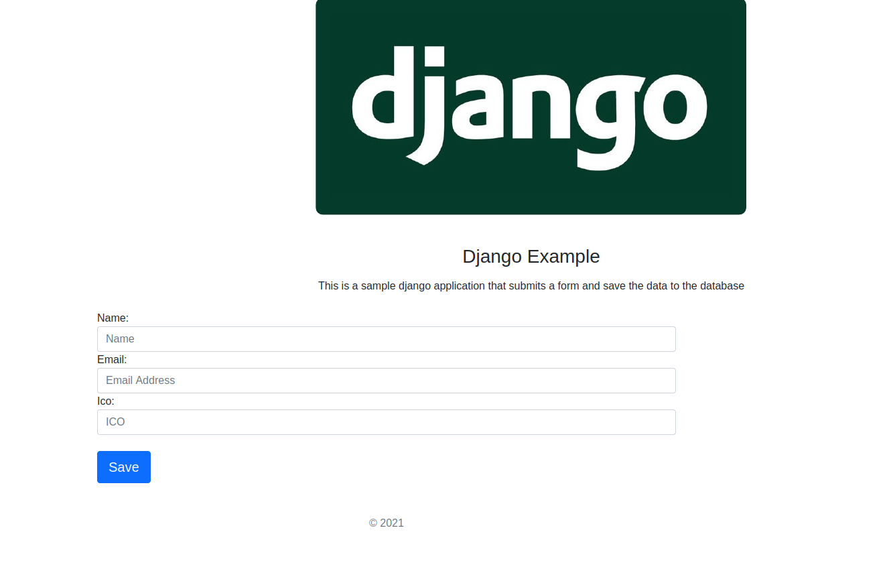

# Proboston-Simple-Django-Demo
A simple application created using **django** the code implements submiting a form to a database.

It runs under officially Django supported versions:
* Django 3.1.
* Python 3 (3.2, 3.4, 3.5, 3.6)




## How to install locally
========================================

This Application can be installed by following the instructions below.

you must have **[python 3](https://www.python.org/downloads/)** > and  [pipenv](https://pypi.org/project/pipenv/)  installed


### Clone thie repository

    $ git clone git@github.com:JuliRash/proboston-demo.git

### Change the directory to the application folder.

    $ cd proboston-demo

### Activate the virtualenv using pipenv

    $ pipenv shell

### Install the requirements for the project

    $ pipenv install -r requirements.txt


### Run migrations and migrate: 
```
python manage.py makemigrations example
python manage.py migrate
```

### Start the App.
```
python manage.py runserver
```


After installation is successfull you can visit the application in this link below.
[http://127.0.0.1:8000](http://127.0.0.1:8000)
